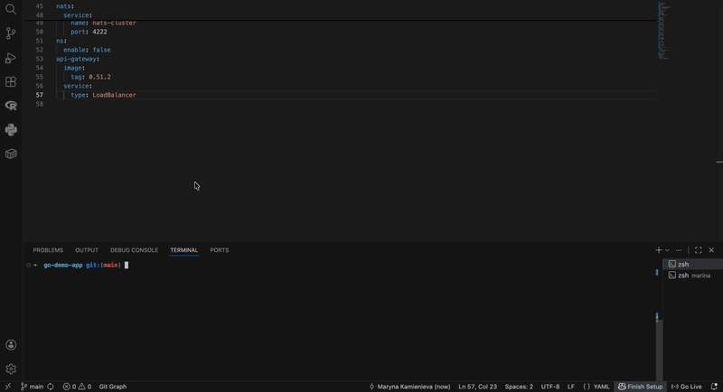

# Minimum Viable Product AsciiArtify

---

## Step-by-Step Guide for ArgoCD Synchronization Verification

* **Prerequisite:** Change a value in your helm values file and commit/push it to repository to trigger the ArgoCD synchronization process

**Command 1: Verify Service Deployment**
    ```bash
    kubectl get svc -n asciiartify
    ```
    ArgoCD fetches the latest version of the Git repository, compares it with the current live state and automatically updates the Kubernetes manifests. This command ensures the new services are successfully deployed and running.

---

**Command 2: Establish Port-Forwarding**
    ```bash
    kubectl port-forward -n asciiartify svc/ambassador 8081:80
    ```
    Expose the ambassador API gateway service to your local machine to allow traffic routing to the application.

---

**Command 3: Test API Gateway Connectivity**
    ```bash
    curl localhost:8081
    ```
    Sends a baseline GET request to ensure that the local port-forwarding is active and the ambassador gateway is responding correctly.

---

**Command 4: Validate Application Functionality (End-to-End Test)**
    ```bash
    curl -F 'image=@/tmp/logo.png' localhost:8081/img/
    ```
    Make sure a sample image exists at the specified path first. This command uploads the image payload to the `/img/` endpoint to verify that the ASCII generation backend is fully operational, properly synchronized, and processing data.

---

## Demo
