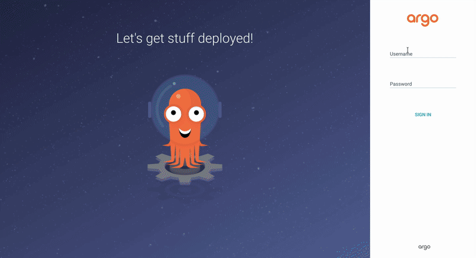

# POC AsciiArtify

Deploying a GitOps system on the Kubernetes variant **k3d** for local test. 
The team recommended the [**ArgoCD product**](https://argo-cd.readthedocs.io/en/stable/getting_started/).
This part will check whether it is technically possible to implement the product concept for **ascii-art on ArgoCD**

---

## What is Argo CD?

**ArgoCD** is a declarative, GitOps continuous delivery (CD) tool for Kubernetes. It monitors your Git repository (which holds your desired cluster configuration) and automatically synchronizes it with the live state of your Kubernetes cluster. If changes occur in Git, Argo CD applies them directly to K8s, eliminating manual interventions.

---

## Step-by-Step Guide and Command Reference

### Phase 1: Preparing the Local Cluster

* **Command 1: Create K8s Cluster**
    ```bash
    k3d cluster create argo
    ```
    Spins up a lightweight local Kubernetes cluster named `argo` using `k3d` (Kubernetes in Docker).

* **Command 2: Verify Cluster Status**
    ```bash
    kubectl cluster-info
    ```
    Displays the control plane and CoreDNS endpoints, confirming that the cluster is up and accessible.

* **Command 3: Inspect Existing Resources**
    ```bash
    k get all -A
    ```
    Lists all active resources (pods, services, deployments) across all namespaces for an initial health check.

---

### Phase 2: Installing Argo CD

* **Command 4: Create a Dedicated Namespace**
    ```bash
    kubectl create namespace argocd
    ```
    Creates an isolated workspace (namespace) named `argocd` where all ArgoCD components will reside.

* **Command 5: Verify Namespace Creation**
    ```bash
    k get ns
    ```
    Lists all available namespaces to ensure that `argocd` was created successfully.

* **Command 6: Deploy Argo CD Components**
    ```bash
    kubectl apply -n argocd --server-side --force-conflicts -f https://raw.githubusercontent.com/argoproj/argo-cd/stable/manifests/install.yaml
    ```
    Installs ArgoCD into the target namespace. The `--server-side` flag applies manifests via server-side logic, and `--force-conflicts` resolves any configuration discrepancies in favor of the new manifests.

---

### Phase 3: Monitoring Deployment

* **Command 7: Check Created Resources**
    ```bash
    k get all -n argocd
    ```
    Lists all pods, services and replicasets generated inside the `argocd` namespace.

* **Command 8: Track Pod Status in Real-Time**
    ```bash
    k get po -n argocd -w
    ```
    Starts a file watch (`-w`) on the Argo CD pods, allowing you to monitor their initialization until they all reach the `Running` state.

---

### Phase 4: Accessing the UI and Authentication

* **Command 9: Expose the Web UI (Port Forwarding)**
    ```bash
    kubectl port-forward svc/argocd-server -n argocd 8080:443&
    ```
    Forwards local port `8080` on your machine to port `443` of the `argocd-server` service in the cluster. The trailing `&` runs the process in the background, letting you access the UI at `https://127.0.0.1:8080`.

* **Command 10: Fetch the Encoded Admin Password**
    ```bash
    kubectl -n argocd get secret argocd-initial-admin-secret -o jsonpath"={.data.password}"
    ```
    Retrieves the auto generated initial password for the `admin` user from Kubernetes Secrets in its raw, Base64 encoded format.

* **Command 11: Decode the Admin Password**
    ```bash
    kubectl -n argocd get secret argocd-initial-admin-secret -o jsonpath"={.data.password}" | base64 -d; echo
    ```
    Decodes the Base64 password string into plain text, allowing you to log into the Argo CD web dashboard.   

---

## Step-by-Step Guide access ArgoCD UI and deployment

